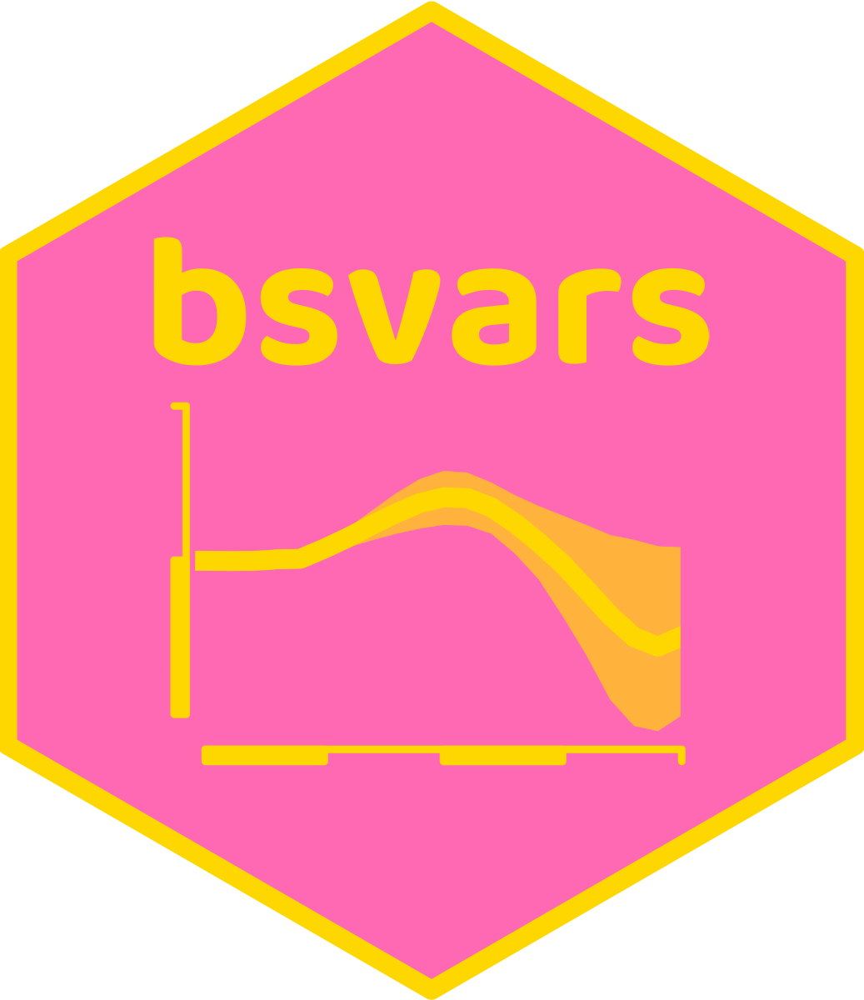
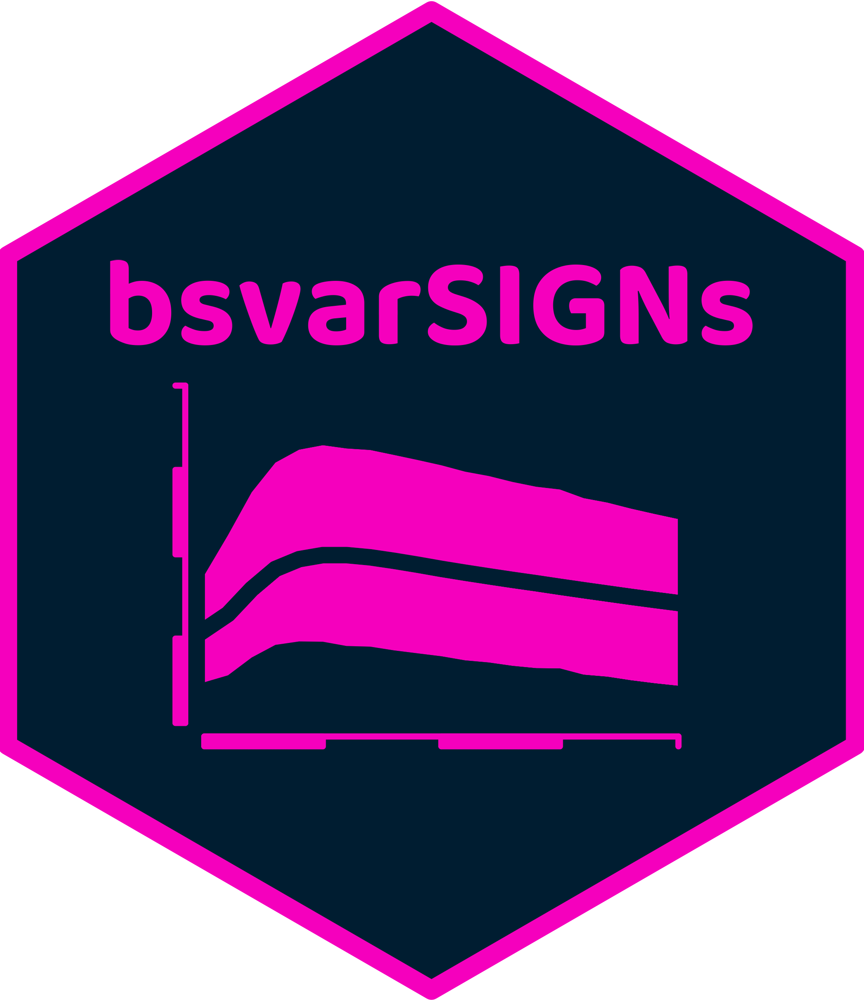
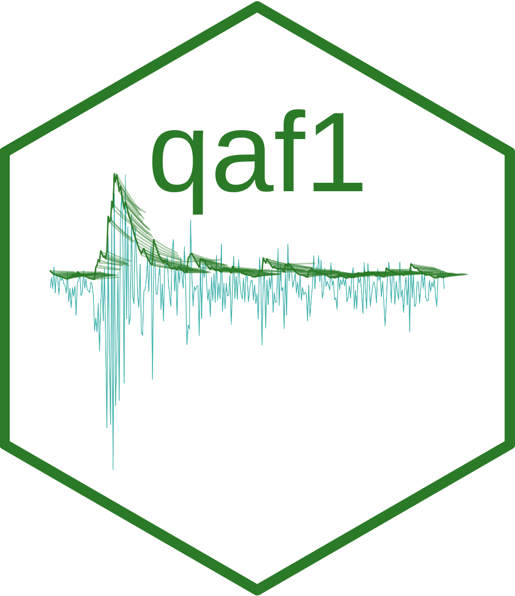

 
 
 
 
 

### Bio

Tomasz is an **econometrician** developing the methodology for empirical macroeconomic analyses. He develops statistical and mathematical models to describe economic reality and measure the effects of government decisions on the real economy.

In his research, he investigates reliable methods for assessing economic hypotheses. For example, he published a series of papers that look at Granger causality in the volatility of financial asset returns and macroeconomic aggregates that exhibit non-linear dynamics. Recently, he has worked on methods for using data to verify and compare alternative monetary policy theories represented as structural time series models.

He works as a Senior Lecturer at the Department of Economics of the University of Melbourne, is a co-founder of the **Bayesian Analysis and Modelling Research Group**, and is a co-organizer of the annual **Melbourne Bayesian Econometrics Workshop** and the **BAM Summer Workshop**.

Tomasz has an extensive teaching portfolio, including developing and lecturing graduate-level subjects, supervising honours, master's, and doctorate students, as well as tutoring programming and project management to his peers. In addition, he has developed original materials for the subjects he is currently teaching **Macroeconometrics**, **Quantitative Analysis of Finance 1**, **Advanced Topics in Bayesian Econometrics**, and **Introduction to R** and subjects he used to teach **Financial Econometrics**, and **Quantitative Analysis of Finance 2**.

He is an author of **R** packages [**bsvars**: Bayesian Estimation of Structural Vector Autoregressive Models](https://cran.r-project.org/package=bsvars) and [**bsvarSIGNs**: Bayesian SVARs with Sign, Zero, and Narrative Restrictions](https://cran.r-project.org/package=bsvarSIGNs) with fast and efficient algorithms for Bayesian analysis of Structural Vector Autoregressions. The packages implement frontier statistical algorithms that are coded using **cpp** via **RcppArmadillo**.

 
 

### Publications

[Markov Switching](https://doi.org/10.1093/acrefore/9780190625979.013.174) with Yong Song, published in the **Oxford Research Encyclopedia of Economics and Finance** in 2021\
[Bayesian Inference for Structural Vector Autoregressions Identified by Markov-Switching Heteroskedasticity](https://doi.org/10.1016/j.jedc.2020.103862) with Helmut Lütkepohl, published in the **Journal of Economic Dynamics and Control** in 2020\
[Granger-Causal Analysis of GARCH Models: a Bayesian Approach](http://dx.doi.org/10.1080/07474938.2015.1092839) published in **Econometric Reviews** in 2018\
[Granger Causality and Regime Inference in Markov-switching VAR Models with Bayesian Methods](http://dx.doi.org/10.1002/jae.2531) with Matthieu Droumaguet and Anders Warne, published in the **Journal of Applied Econometrics** in 2017\
[Bayesian Vector Autoregressions](http://dx.doi.org/10.1111/1467-8462.12179) published in the **Australian Economic Review** in 2016\
[Testing Causality Between Two Vectors in Multivariate GARCH Models](https://doi.org/10.1016/j.ijforecast.2015.01.005) published in the **International Journal of Forecasting** in 2015

### Thesis

[Granger-Causal Analysis of Conditional Mean and Volatility Models](http://cadmus.eui.eu/bitstream/handle/1814/25136/2012_Wozniak.pdf) defended at the **European University Institute** on 18 December 2012

### R packages

More details at [bsvars.org](https://bsvars.org/)

[**bsvars**: Bayesian Estimation of Structural Vector Autoregressive Models](https://cran.r-project.org/package=bsvars)\
[**bsvarSIGNs**: Bayesian Estimation of Structural Vector Autoregressive Models Identified by Sign and Narrative Restrictions](https://cran.r-project.org/package=bsvarSIGNs)\
[**bvarPANELs**: Forecasting with Bayesian Hierarchical Panel Vector Autoregressions](https://github.com/bsvars/bvarPANELs) developed for UN's International Labour Organization\
[**bsvarTVPs**: Bayesian Estimation of Heteroskedastic Structural Vector Autoregressions with Markov-Switching and Time-Varying Identification of the Structural Matrix](https://github.com/bsvars/bsvarTVPs)

### R code

[Bayesian Inference for Structural Vector Autoregressions Identified with Markov-Switching Heteroskedasticity](https://gitlab.com/tomaszwozniak/SVAR-MSH-ID)\
[Bayesian Estimation of Markov-Switching VARs for Granger Causal Inference in R](https://gitlab.com/tomaszwozniak/BayesianMS-VAR-GC)\
[Bayesian Estimation and Inference for the ECCC-GARCH Model in R](https://gitlab.com/tomaszwozniak/BayesianECCCGARCH)

### Blogposts and Media

 
 
 

[Rewriting R code in C++](https://arp.numbat.space/week12/) a guest lecture for [Advanced R Programming](https://arp.numbat.space/) given on 22 May 20204\
[Simulation Smoother using RcppArmadillo](https://gallery.rcpp.org/articles/simulation-smoother-using-rcpparmadillo/) published in the [**Rcpp Gallery**](https://gallery.rcpp.org/) on 5 September 2021

[Teaching and Learning (Time Series) Econometrics](https://donotdespair.edublogs.org)

[Labor's election year budget](https://www.sbs.com.au/language/polish/pl/podcast-episode/budzetp-partii-pracy-w-australii-2024/8xervq3yi) **SBS Polish Radio** broadcasted on 20 May 2024\
[Tomasz on University of Melbourne's Proposal to Raid Our Super](https://www.youtube.com/watch?v=u7rb2Ov-JIc) a comment for the **NTEU** published on 11 July 2023\
[Melbourne Uni's 'bizarre' 6pc pay rise proposal](https://www.afr.com/work-and-careers/workplace/melbourne-uni-s-bizarre-6pc-pay-rise-proposal-20230621-p5dib2) a comment at **The Australian Financial Review** published on 22 June 2023\
[Should Labour get rid of the negative gearing?](https://www.sbs.com.au/language/polish/pl/podcast-episode/czy-partia-pracy-powinna-usunac-negative-gearing/993sby371) **SBS Polish Radio** broadcasted on 28 May 2023\
[What's good in Labor's budget?](https://www.sbs.com.au/language/polish/pl/podcast-episode/co-dobrego-w-budzecie-laburzystow-w-australii/x1jzee0gb) **SBS Polish Radio** broadcasted on 21 May 2023\
[Finder's RBA cash rate survey: October](https://www.finder.com.au/rba-survey-28-october-2022) published on 28 October 2022, gets mentioned [here](https://www.news.com.au/finance/economy/interest-rates/bitter-pill-to-swallow-experts-grim-4-interest-rate-warning/news-story/8d95ff725a45b705649c4c2dca88589f), [here](https://www.news.com.au/finance/economy/interest-rates/too-much-rba-tipped-to-confirm-seventh-consecutive-rate-rise-as-mortgage-cliff-looms/news-story/8f9c421356f5a9f8c703ebc61810ebb7), [here](https://www.finder.com.au/rba-survey-1-november-2022), [here](https://www.dailymail.co.uk/news/article-11375371/Warning-Australian-property-prices-start-slide-faster-rates-rising.html), and [here](https://dynamicbusiness.com/topics/news/there-will-likely-be-another-cash-rate-hike-on-nov-1.html)\
[The first budget of Labor government](https://www.sbs.com.au/language/polish/pl/podcast-episode/pierwszy-budzet-nowego-rzadu-australii-dobry-czy-z%C5%82y/gbmc1sphf) **SBS Polish Radio** broadcasted on 30 October 2022\
[Australian economy is relatively fine](https://www.sbs.com.au/language/polish/audio/gospodarka-australii-ma-sie-dobrze) **SBS Polish Radio** broadcasted on 10 April 2022\
[2022 Budget of Australia... Good or bad?](https://www.sbs.com.au/language/polish/audio/budzet-australii-2022-dobry-czy-zly) **SBS Polish Radio** broadcasted on 3 April 2022\
[Budget of lost opportunities?](https://www.sbs.com.au/language/polish/audio/budzet-straconych-szans) **SBS Polish Radio** broadcasted on 16 May 2021\
[Unemployment and real estate market during the coronavirus crisis](https://www.sbs.com.au/yourlanguage/audiotrack/dr-t-wozniak-bezrobocie) **SBS Polish Radio** broadcasted on 30 August 2020\
[Will the Australian economy survive during pandemic?](https://www.sbs.com.au/language/english/audio/will-the-australian-economy-survive-during-pandemic) **SBS Polish Radio** broadcasted on 7 June 2020\
[Economic policy during coronavirus pandemic in Australia](https://www.youtube.com/watch?v=Jb261mrTa9M&ab_channel=AustralianInstituteofPolishAffairs) **Australian Institute for Polish Affairs** youtube channel published on 8 May 2020

[PSE](bsvars_PSEuninelb.pdf)